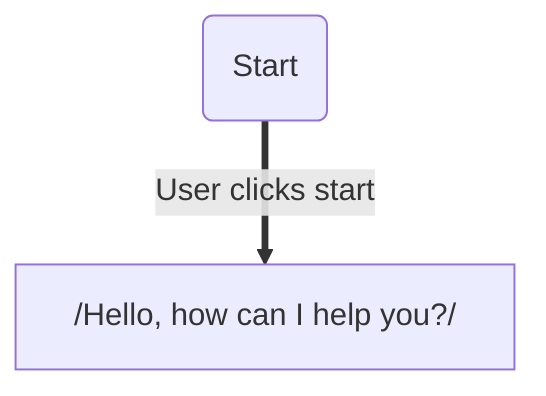
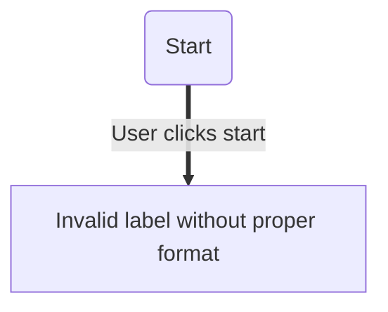

# Pre-commit Setup for Mermaid Template Checker

This document explains how to set up and use the mermaid template checker as a pre-commit hook.

## Quick Setup

### Option 1: Automated Setup (Recommended)

```bash
# Run the setup script
./scripts/setup-pre-commit.sh
```

This script will:
- Check if pre-commit is installed and install it if needed
- Verify Deno is available
- Install the pre-commit hooks
- Configure the mermaid checker to run on markdown files

### Option 2: Manual Setup

```bash
# Install pre-commit
pip install pre-commit

# Install the hooks
pre-commit install
```

## How It Works

The pre-commit hook will:

1. **Trigger**: Run automatically before each commit when markdown files are staged
2. **Scope**: Check all markdown files in the repository (not just staged ones)
3. **Validation**: Validate all mermaid diagrams according to the template rules
4. **Action**: Prevent the commit if any validation errors are found

## Usage

### Normal Workflow

```bash
# Make changes to markdown files
git add .

# Commit (pre-commit hook runs automatically)
git commit -m "Add new mermaid diagram"

# If validation fails, fix the issues and try again
```

### Manual Testing

```bash
# Test all files in the repository
pre-commit run --all-files

# Test only the mermaid checker hook
pre-commit run mermaid-checker --all-files

# Test on specific files
pre-commit run mermaid-checker --files path/to/file.md
```

### Skipping the Hook (Not Recommended)

```bash
# Skip pre-commit hooks for this commit
git commit --no-verify -m "Emergency fix"
```

## Configuration

The pre-commit configuration is in `.pre-commit-config.yaml`:

```yaml
repos:
  - repo: local
    hooks:
      - id: mermaid-checker
        name: Mermaid Template Checker
        entry: deno run --allow-read main.ts
        language: system
        types: [markdown]
        pass_filenames: false
        args: ["."]
        description: "Validates mermaid flowcharts in markdown files"
```

### Configuration Options

- **`types: [markdown]`**: Only runs on markdown files
- **`pass_filenames: false`**: Runs on the entire repository, not just staged files
- **`args: ["."]`**: Checks the current directory recursively

## Troubleshooting

### Common Issues

1. **"Deno not found"**
   ```bash
   # Install Deno
   curl -fsSL https://deno.land/x/install/install.sh | sh
   ```

2. **"pre-commit not found"**
   ```bash
   # Install pre-commit
   pip install pre-commit
   ```

3. **Permission denied on setup script**
   ```bash
   # Make script executable
   chmod +x scripts/setup-pre-commit.sh
   ```

4. **Hook not running**
   ```bash
   # Reinstall hooks
   pre-commit uninstall
   pre-commit install
   ```

### Updating Hooks

```bash
# Update pre-commit hooks
pre-commit autoupdate

# Reinstall hooks
pre-commit install
```

## Integration with CI/CD

The pre-commit hook works alongside existing CI/CD pipelines:

- **Local**: Pre-commit prevents invalid commits
- **CI**: GitHub Actions can run the same validation
- **Consistency**: Same validation rules applied everywhere

## Best Practices

1. **Always run pre-commit**: Don't skip the hooks unless absolutely necessary
2. **Fix issues locally**: Resolve validation errors before pushing
3. **Test regularly**: Run `pre-commit run --all-files` periodically
4. **Keep updated**: Update pre-commit hooks when new versions are available

## Examples

### Valid Mermaid Diagram

```markdown

```

### Invalid Mermaid Diagram (Will be caught by pre-commit)

```markdown

```

The pre-commit hook will catch the invalid label format and prevent the commit until it's fixed. 

## Example: Using in Your Own Project

To use the mermaid template checker as a pre-commit hook in your own repository, add this to your `.pre-commit-config.yaml`:

```yaml
repos:
  - repo: https://github.com/dexoon/mermaid-template-checker
    rev: v1.0.0  # Use the latest release
    hooks:
      - id: mermaid-checker
        name: Mermaid Template Checker
        entry: deno run --allow-read main.ts
        language: system
        types: [markdown]
        pass_filenames: false
        args: ["."]
        description: "Validates mermaid flowcharts in markdown files"
```

Then run:

```bash
pip install pre-commit
pre-commit install
```

This will ensure all your markdown files are checked before each commit. 