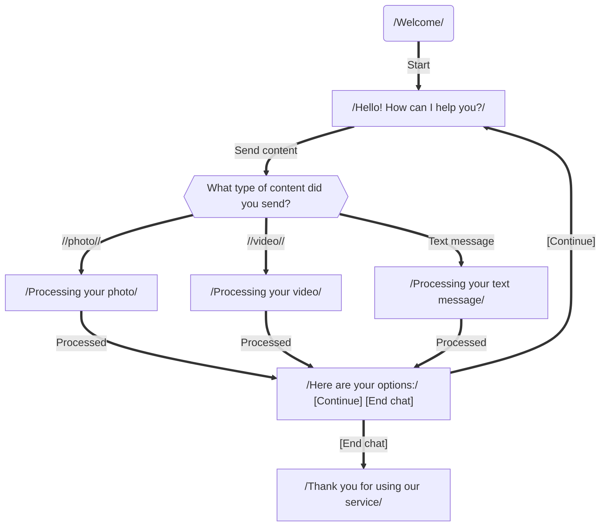

# Chat Bot Flow

```mermaid
flowchart TD
  %% Node Definitions
  WELCOME("/Welcome/")
  GREETING["/Hello! How can I help you?/"]
  CHOICE{{"What type of content did you send?"}}
  PHOTO["/Processing your photo/"]
  VIDEO["/Processing your video/"]
  TEXT["/Processing your text message/"]
  BUTTON["/Here are your options:/ [Continue] [End chat]"]
  END["/Thank you for using our service/"]
  
  %% Connections
  WELCOME == "Start" ==> GREETING
  GREETING == "Send content" ==> CHOICE
  CHOICE == "//photo//" ==> PHOTO
  CHOICE == "//video//" ==> VIDEO
  CHOICE == "Text message" ==> TEXT
  PHOTO == "Processed" ==> BUTTON
  VIDEO == "Processed" ==> BUTTON
  TEXT == "Processed" ==> BUTTON
  BUTTON == "[Continue]" ==> GREETING
  BUTTON == "[End chat]" ==> END
```

This flowchart demonstrates all node types and connection patterns from the template rules. 