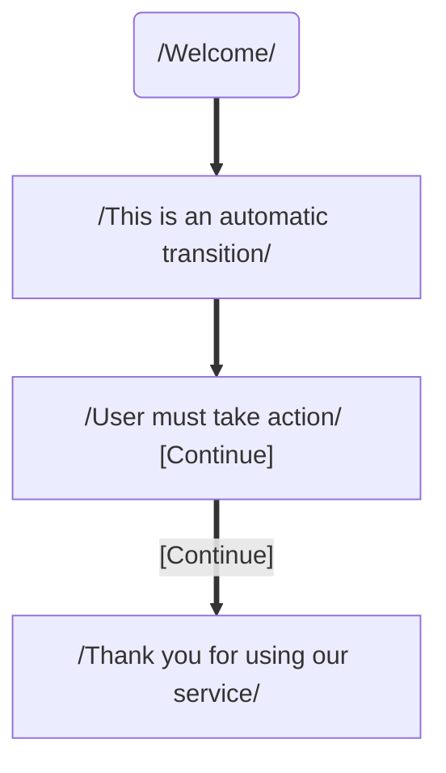

# Connection Without Comments

```mermaid
flowchart TD
  %% Node Definitions
  START("/Welcome/")
  AUTOMATIC["/This is an automatic transition/"]
  MANUAL["/User must take action/ [Continue]"]
  END["/Thank you for using our service/"]
  
  %% Connections
  START ==> AUTOMATIC
  AUTOMATIC ==> MANUAL
  MANUAL == "[Continue]" ==> END
```

This flowchart demonstrates connections both with and without comments - some transitions are automatic and don't require user actions.
