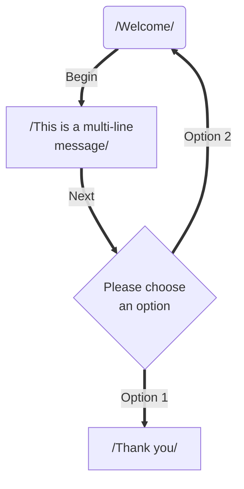

# Multi-line Node Definitions

```mermaid
flowchart TD
  %% Node Definitions
  START("/Welcome/")
  MESSAGE["/This is a multi-line\nmessage/"]
  CHOICE{"Please choose\nan option"}
  END["/Thank you/"]
  
  %% Connections
  START == "Begin" ==> MESSAGE
  MESSAGE == "Next" ==> CHOICE
  CHOICE == "Option 1" ==> END
  CHOICE == "Option 2" ==> START
```

This flowchart demonstrates multi-line node definitions as specified in the template rules. 