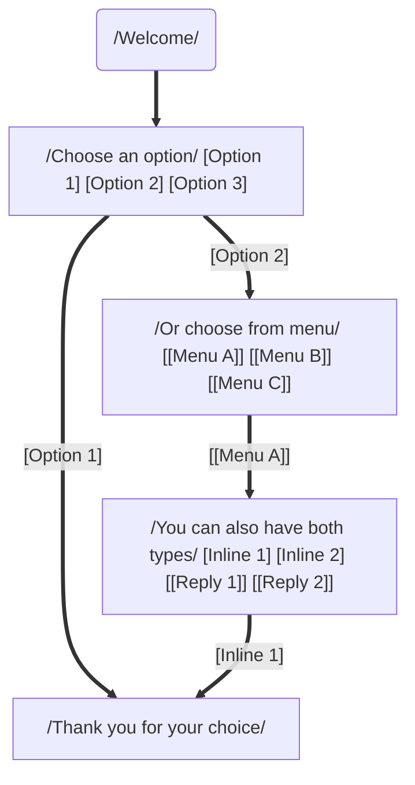

# Multiple Buttons Same Type

```mermaid
flowchart TD
  %% Node Definitions
  START("/Welcome/")
  MULTIPLE_INLINE["/Choose an option/ [Option 1] [Option 2] [Option 3]"]
  MULTIPLE_REPLY["/Or choose from menu/ [[Menu A]] [[Menu B]] [[Menu C]]"]
  MIXED_BUTTONS["/You can also have both types/ [Inline 1] [Inline 2] [[Reply 1]] [[Reply 2]]"]
  END["/Thank you for your choice/"]
  
  %% Connections
  START ==> MULTIPLE_INLINE
  MULTIPLE_INLINE == "[Option 1]" ==> END
  MULTIPLE_INLINE == "[Option 2]" ==> MULTIPLE_REPLY
  MULTIPLE_REPLY == "[[Menu A]]" ==> MIXED_BUTTONS
  MIXED_BUTTONS == "[Inline 1]" ==> END
```

This flowchart demonstrates Rectangle nodes with multiple buttons of the same type and mixed button types as specified in the rules.
