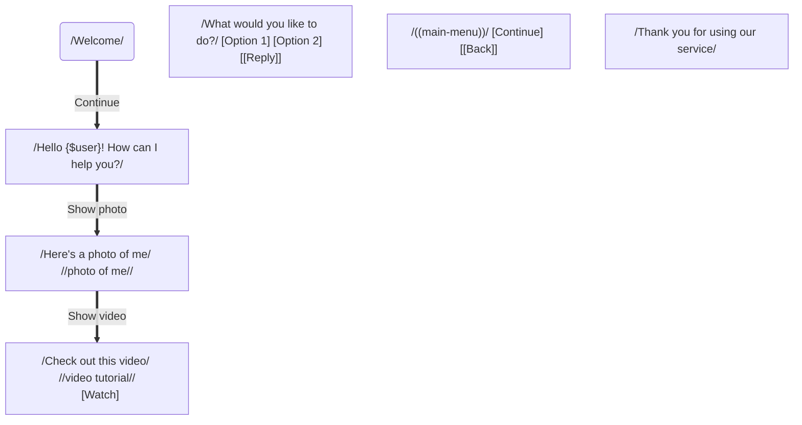

# Rectangle Node Examples

```mermaid
flowchart TD
  %% Node Definitions
  START("/Welcome/")
  GREETING["/Hello {$user}! How can I help you?/"]
  PHOTO["/Here's a photo of me/ //photo of me//"]
  VIDEO["/Check out this video/ //video tutorial//
  [Watch]"]
  MENU["/What would you like to do?/ [Option 1] [Option 2] [[Reply]]"]
  TEMPLATE["/((main-menu))/ [Continue] [[Back]]"]
  END["/Thank you for using our service/"]
  
  %% Connections
  START == "Continue" ==> GREETING
  GREETING == "Show photo" ==> PHOTO
  PHOTO == "Show video" ==> VIDEO
```

This flowchart demonstrates Rectangle nodes with text, media, and buttons according to the new rules. 