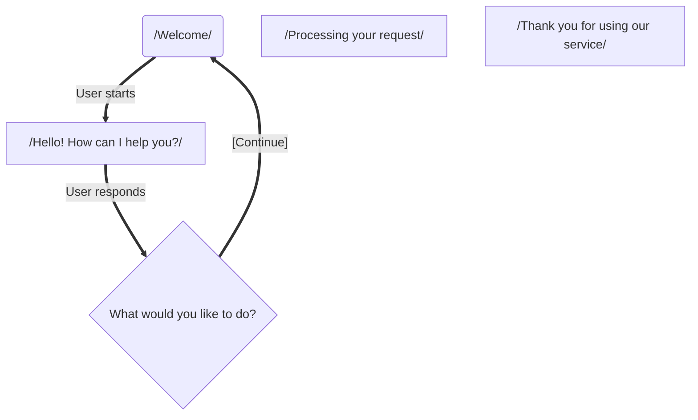

# Reply Buttons

```mermaid
flowchart TD
  %% Node Definitions
  START("/Welcome/")
  GREETING["/Hello! How can I help you?/"]
  CHOICE{"What would you like to do?"}
  PROCESS["/Processing your request/"]
  END["/Thank you for using our service/"]
  
  %% Connections
  START == "User starts" ==> GREETING
  GREETING == "User responds" ==> CHOICE
  CHOICE == "[Continue]" ==> START
```

This flowchart demonstrates reply buttons [[reply]] in node definitions. 