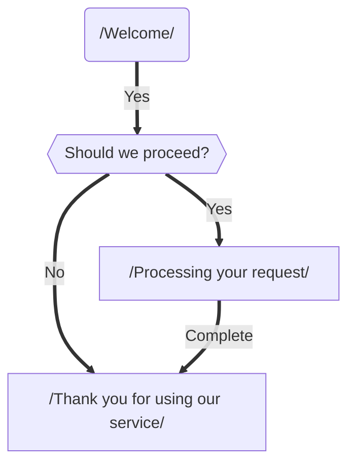

# Simple Flowchart

```mermaid
flowchart TD
  %% Node Definitions
  START("/Welcome/")
  DECISION{{"Should we proceed?"}}
  PROCESS["/Processing your request/"]
  END["/Thank you for using our service/"]
  
  %% Connections
  START == "Yes" ==> DECISION
  DECISION == "Yes" ==> PROCESS
  DECISION == "No" ==> END
  PROCESS == "Complete" ==> END
```

This flowchart follows the template rules with proper node definitions and connections. 