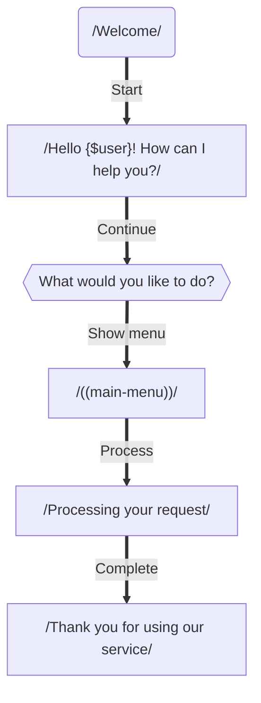

# Variables and Templates

```mermaid
flowchart TD
  %% Node Definitions
  WELCOME("/Welcome/")
  GREETING["/Hello {$user}! How can I help you?/"]
  CHOICE{{"What would you like to do?"}}
  TEMPLATE["/((main-menu))/"]
  PROCESS["/Processing your request/"]
  END["/Thank you for using our service/"]
  
  %% Connections
  WELCOME == "Start" ==> GREETING
  GREETING == "Continue" ==> CHOICE
  CHOICE == "Show menu" ==> TEMPLATE
  TEMPLATE == "Process" ==> PROCESS
  PROCESS == "Complete" ==> END
```

This flowchart demonstrates variables {$variables} and templates ((templates)) in node definitions. 