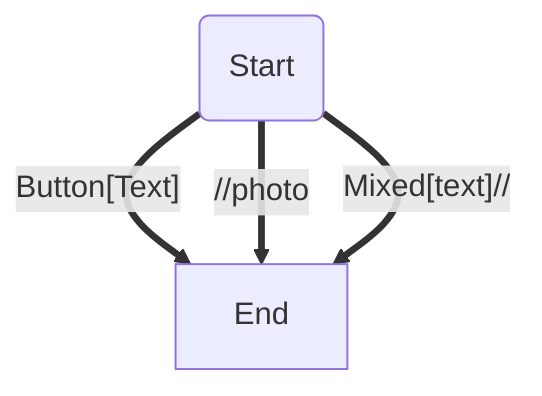

# Invalid Comment Format

```mermaid
flowchart TD
%% Node Definitions
START("Start")
END["End"]

%% Connections
START == "Button[Text]" ==> END
START == "//photo" ==> END
START == "Mixed[text]//" ==> END
```

This flowchart uses invalid comment formats that don't match the template rules. 