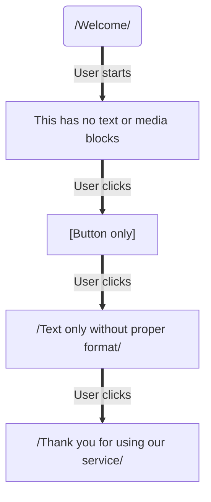

# Invalid Rectangle Node

```mermaid
flowchart TD
%% Node Definitions
START("/Welcome/")
INVALID["This has no text or media blocks"]
INVALID2["[Button only]"]
INVALID3["/Text only without proper format/"]
END["/Thank you for using our service/"]

%% Connections
START == "User starts" ==> INVALID
INVALID == "User clicks" ==> INVALID2
INVALID2 == "User clicks" ==> INVALID3
INVALID3 == "User clicks" ==> END
```

This flowchart has Rectangle nodes that don't follow the new Rectangle node definition rules. 