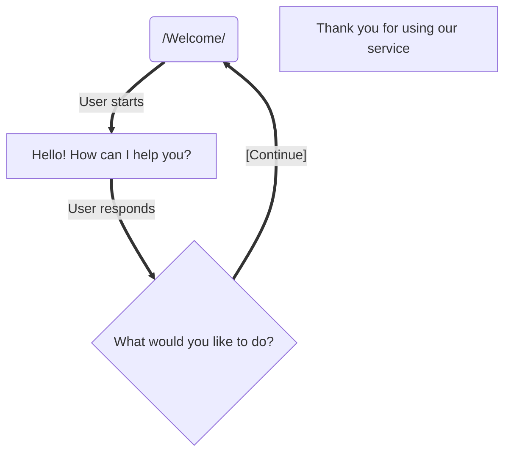

# Missing Text/Media Blocks

```mermaid
flowchart TD
%% Node Definitions
START("/Welcome/")
GREETING["Hello! How can I help you?"]
CHOICE{"What would you like to do?"}
END["Thank you for using our service"]

%% Connections
START == "User starts" ==> GREETING
GREETING == "User responds" ==> CHOICE
CHOICE == "[Continue]" ==> START
```

This flowchart has nodes that don't start with /text/ or //media// blocks. 