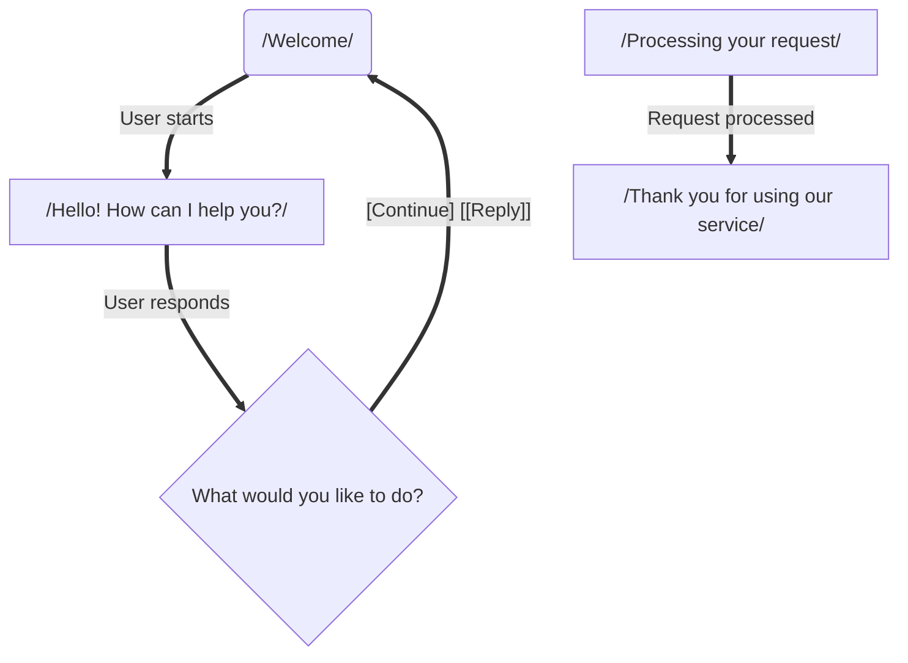

# Mixed Button Types

```mermaid
flowchart TD
%% Node Definitions
START("/Welcome/")
GREETING["/Hello! How can I help you?/"]
CHOICE{"What would you like to do?"}
PROCESS["/Processing your request/"]
END["/Thank you for using our service/"]

%% Connections
START == "User starts" ==> GREETING
GREETING == "User responds" ==> CHOICE
CHOICE == "[Continue] [[Reply]]" ==> START
PROCESS == "Request processed" ==> END
```

This flowchart has a connection comment with mixed button types which is not allowed. 