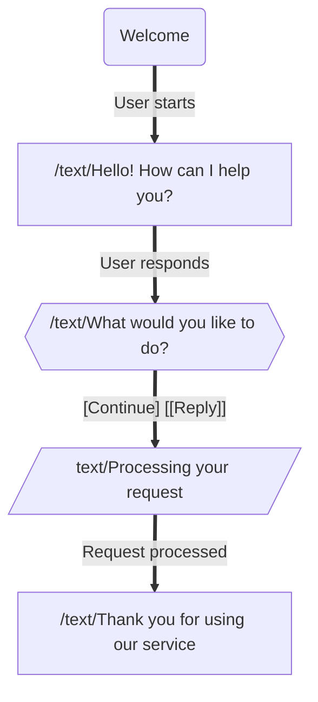

# Mixed Button Types

```mermaid
flowchart TD
%% Node Definitions
WELCOME("Welcome")
GREETING["/text/Hello! How can I help you?"]
CHOICE{{/text/What would you like to do?}}
PROCESS[/text/Processing your request/]
END["/text/Thank you for using our service"]

%% Connections
WELCOME == "User starts" ==> GREETING
GREETING == "User responds" ==> CHOICE
CHOICE == "[Continue] [[Reply]]" ==> PROCESS
PROCESS == "Request processed" ==> END
```

This flowchart has nodes with mixed button types which is not allowed. 