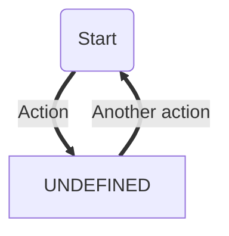

# Undefined Nodes

```mermaid
flowchart TD
%% Node Definitions
START("Start")

%% Connections
START == "Action" ==> UNDEFINED
UNDEFINED == "Another action" ==> START
```

This flowchart references undefined nodes in the connections section. 