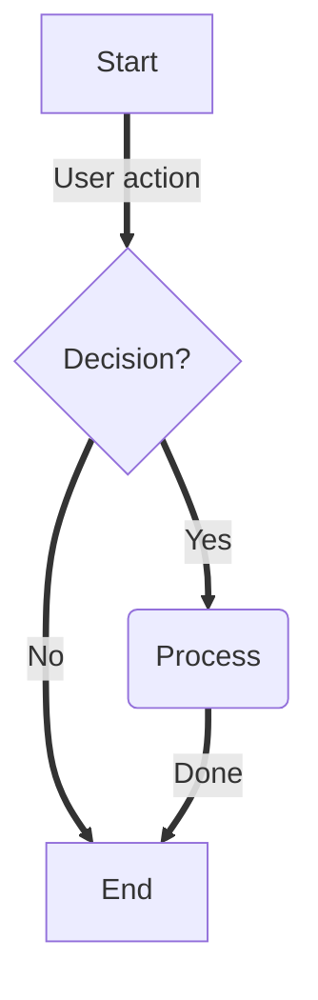

# Wrong Node Syntax

```mermaid
flowchart TD
%% Node Definitions
START[Start]
DECISION{Decision?}
PROCESS(Process)
END[End]

%% Connections
START == "User action" ==> DECISION
DECISION == "Yes" ==> PROCESS
DECISION == "No" ==> END
PROCESS == "Done" ==> END
```

This flowchart uses incorrect node syntax that doesn't match the template rules. 