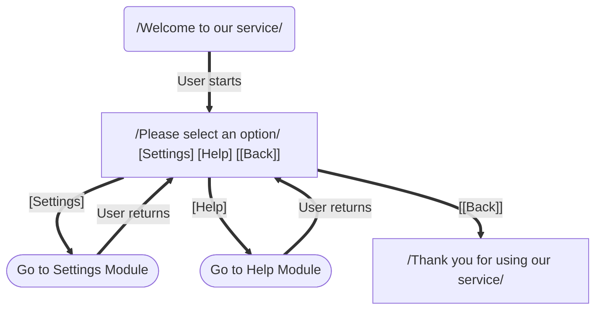

# Stadium Shaped Node Example

This file demonstrates the new stadium shaped node type for transitions to other FSM modules.

The stadium shaped nodes (SETTINGS and HELP) represent transitions to other FSM modules. 